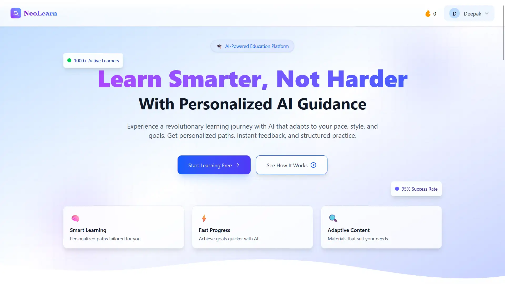

# 🚀 NeoLearn

> _AI-Powered Career Guidance Platform for Students_  
> 🌐 **Live Demo**: [neolearn.vercel.app](https://neolearn.vercel.app/)
## 📸 App Screenshot


---

## 🧠 About the Project

**NeoLearn** is an AI-powered web application that helps students discover and pursue personalized learning paths tailored to their **skills**, **interests**, **age**, and **career goals**.

By filling a short profile, students receive:
- 🎯 A structured learning journey
- 📖 Explanations
- 🃏 Flashcards
- ❓ Quizzes
- 💡 Smart motivational nudges

These are generated in real-time using **Gemini Flash 2.0** and **Llama 3.3 70B**, enabling personalized learning like never before.

---

## 🔥 Features

- ✅ AI-generated learning paths (Gemini)
- 📚 Skill-based module suggestions
- 📊 Career readiness tracking
- 🧠 Flashcards + interactive quizzes
- 💬 AI nudges based on user progress
- 🔐 Appwrite Authentication + Database
- 🎨 Beautiful, responsive UI (Tailwind + Framer Motion)

---

## 🛠 Tech Stack

| Category        | Tech Used                                  |
|----------------|---------------------------------------------|
| 💻 Frontend     | React.js, Tailwind CSS, Framer Motion        |
| 🧠 AI Engine    | Gemini 2.0 Flash API (Google), Groq (opt.)   |
| 🔐 Backend      | Appwrite (Auth + Database)                   |
| 🌐 Hosting      | Vercel                              |

---

## 📁 .env.example

```env
# Appwrite Config
VITE_APPWRITE_ENDPOINT=https://cloud.appwrite.io/v1
VITE_APPWRITE_PROJECT_ID=NeoLearn
VITE_APPWRITE_DATABASE_ID=NeoLearn
VITE_USERS_COLLECTION_ID=users
VITE_CAREER_PATHS_COLLECTION_ID=career-paths
VITE_ASSESSMENTS_COLLECTION_ID=assessments

# Gemini API Key
VITE_GEMINI_API_KEY=your_gemini_key_here

# Optional: Groq (fallback)
VITE_GROQ_API_KEY=your_groq_key_here
```

---

## 📦 Getting Started

```bash
git clone https://github.com/decodewithdeepak/NeoLearn.git
cd NeoLearn
npm install
cp .env.example .env   # Replace with your actual API keys
npm run dev
```

---


## 📃 License

MIT License © 2025 — Deepak Modi
